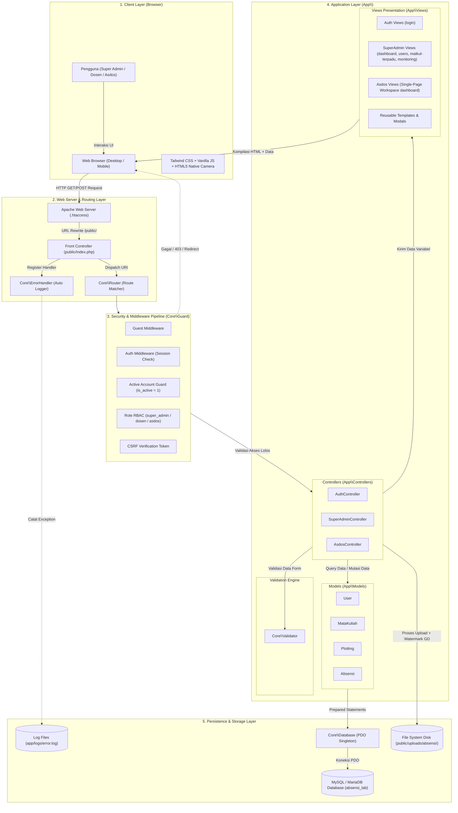
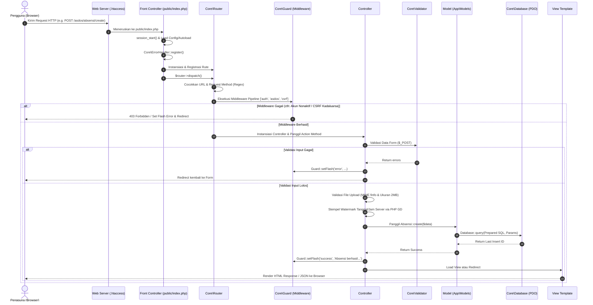

# 🏗️ Arsitektur Sistem & Spesifikasi Teknis (ARCHITECTURE.md)

Dokumen ini menjelaskan arsitektur perangkat lunak, pola desain (_design patterns_), serta alur siklus hidup _request_ (_Request Lifecycle_) yang diimplementasikan pada aplikasi **Sistem Informasi Absensi & Penugasan Asisten Laboratorium (Absensi Asdos)**.

---

## 1. Diagram Arsitektur High-Level

Aplikasi ini menggunakan arsitektur **3-Tier Monolith MVC** (Model-View-Controller) murni berbasis PHP Native berorientasi objek yang ringan, aman, dan tanpa dependensi framework eksternal yang berat.

### 📊 Diagram Aliran Data (Data Flow Architecture)

---

## 2. Pola Desain (Design Patterns) yang Diterapkan

Codebase ini menerapkan sejumlah pola desain terstandar untuk memastikan modularitas, kemudahan pemeliharaan, serta keamanan tingkat tinggi:

### 1. Front Controller Pattern

- **Implementasi:** [`public/index.php`](file:///c:/laragon/www/absensi_labb/public/index.php) dan [`.htaccess`](file:///c:/laragon/www/absensi_labb/.htaccess).
- **Penjelasan:** Seluruh _request_ HTTP yang masuk ke server dialihkan ke satu file pintu masuk tunggal (`public/index.php`). File ini bertanggung jawab menginisialisasi sesi, zona waktu, konstanta konfigurasi, _autoloader_, _global error handler_, dan mendelegasikan eksekusi rute ke _Router_.
- **Keuntungan:** Keamanan terpusat, menghindari celah akses file PHP langsung di subdirektori publik, dan struktur URL yang bersih (_clean URL_).

### 2. Model-View-Controller (MVC) Pattern

- **Implementasi:**
  - **Model (`app/Models/`):** [`User.php`](file:///c:/laragon/www/absensi_labb/app/Models/User.php), [`MataKuliah.php`](file:///c:/laragon/www/absensi_labb/app/Models/MataKuliah.php), [`Plotting.php`](file:///c:/laragon/www/absensi_labb/app/Models/Plotting.php), [`Absensi.php`](file:///c:/laragon/www/absensi_labb/app/Models/Absensi.php).
  - **View (`app/Views/`):** Direktori `Auth/`, `SuperAdmin/`, `Asdos/` (Single-Page Workspace), dan `Templates/`.
  - **Controller (`app/Controllers/`):** [`AuthController.php`](file:///c:/laragon/www/absensi_labb/app/Controllers/AuthController.php), [`SuperAdminController.php`](file:///c:/laragon/www/absensi_labb/app/Controllers/SuperAdminController.php), [`AsdosController.php`](file:///c:/laragon/www/absensi_labb/app/Controllers/AsdosController.php).

### 3. Single-Page Course-Centric Workspace (Asdos)

- **Implementasi:** [`app/Views/Asdos/dashboard.php`](file:///c:/laragon/www/absensi_labb/app/Views/Asdos/dashboard.php) dan [`app/Controllers/AsdosController.php`](file:///c:/laragon/www/absensi_labb/app/Controllers/AsdosController.php).
- **Penjelasan:** Pengalaman asisten dosen dipusatkan pada kartu-kartu mata kuliah praktikum di halaman dashboard utama. Tindakan pengisian absensi (kamera native live capture) dan peninjauan riwayat dieksekusi secara asinkron/modal langsung dari mata kuliah terkait tanpa perpindahan halaman yang membebani memori.

### 4. Consolidated Modal Workflow (Super Admin)

- **Implementasi:** [`app/Views/SuperAdmin/matkul.php`](file:///c:/laragon/www/absensi_labb/app/Views/SuperAdmin/matkul.php) dan [`app/Controllers/SuperAdminController.php`](file:///c:/laragon/www/absensi_labb/app/Controllers/SuperAdminController.php).
- **Penjelasan:** Pengelolaan master mata kuliah dan plotting asisten dosen digabungkan dalam satu menu. Pembuatan plotting baru atau penonaktifan plotting dilakukan langsung secara kontekstual dari kartu mata kuliah terkait.

### 5. Singleton Pattern (Database Connection)

- **Implementasi:** [`Core\Database::getConnection()`](file:///c:/laragon/www/absensi_labb/Core/Database.php#L32).
- **Penjelasan:** Memastikan hanya ada **satu instance koneksi PDO** yang dibuat dan digunakan secara bersamaan (_shared connection_) selama satu _lifecycle_ request.

### 6. Middleware Pipeline Pattern

- **Implementasi:** [`Core\Router::runMiddlewares()`](file:///c:/laragon/www/absensi_labb/Core/Router.php#L104).
- **Daftar Middleware:**
  - `guest`: Memastikan user belum login.
  - `auth`: Memastikan user sudah memiliki sesi login aktif.
  - `active`: Memastikan akun user berstatus aktif (`is_active = 1`).
  - `super_admin` / `dosen` / `asdos`: Role-Based Access Control (RBAC).
  - `csrf`: Verifikasi kecocokan token anti-pemalsuan request.

### 7. Security Guard & Flash Messenger

- **Implementasi:** [`Core\Guard`](file:///c:/laragon/www/absensi_labb/Core/Guard.php).
- **Fitur Utama:**
  - Idempotent `Guard::url()` (mencegah duplikasi base URL prefix pada subfolder server).
  - CSRF Token generation & verification.
  - Role checking & Active account enforcement.
  - Flash session alerts.

---

## 3. Alur Siklus Hidup Request (Request Lifecycle)

Setiap request dari browser diproses melalui 7 tahap berurutan:

---

## 4. Keamanan Sistem (Security Architecture)

1. **Perlindungan SQL Injection:** 100% interaksi database menggunakan PDO Prepared Statements dengan parameter binding (`:param`).
2. **Perlindungan Cross-Site Scripting (XSS):** Semua data dinamis disanitasi menggunakan `htmlspecialchars(..., ENT_QUOTES, 'UTF-8')`.
3. **Perlindungan CSRF:** Setiap formulir POST wajib menyertakan token CSRF unik per sesi.
4. **Hashing Kata Sandi:** Menggunakan algoritma hashing kuat `bcrypt` (`PASSWORD_DEFAULT`).
5. **Validasi File Upload & Server Watermarking:**
   - Pemeriksaan ukuran maksimal (2 MB).
   - Validasi MIME Type asli melalui PHP `finfo` (`image/jpeg`, `image/png`, `image/webp`).
   - Koreksi orientasi EXIF & penambahan watermark timestamp server permanen melalui pustaka GD bawaan PHP.
   - Pengacakan nama file simpanan menggunakan `bin2hex(random_bytes(16))`.
6. **Active Account Guard (BR2):** Penegakan aturan bahwa akun nonaktif berada dalam mode _read-only_ (seluruh aksi mutasi diblokir di middleware, controller, dan antarmuka JavaScript).
