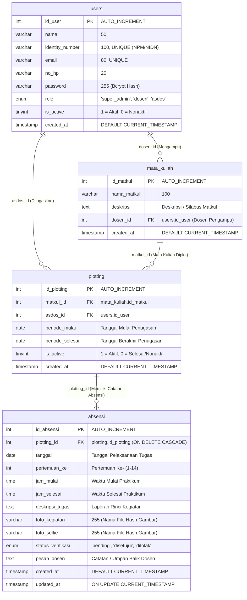

# 🗄️ Gambaran Umum & Struktur Database (DATABASE_OVERVIEW.md)

Dokumen ini menjelaskan struktur fisik database, diagram relasi entitas (*Entity-Relationship Diagram* / ERD), kamus kolom, indeks, batasan integritas (*Foreign Key Constraints*), serta penjelasan nilai-nilai *enum* dan *flags* yang digunakan dalam database sistem **Absensi Lab** (`absensi_lab`).

---

## 1. Diagram Relasi Entitas (Mermaid ERD)

Database ini dirancang dengan prinsip normalisasi relasional untuk menjamin integritas data penugasan asisten dan riwayat pencatatan absensi.

---

## 2. Rincian Skema & Kamus Tabel (Table Data Dictionary)

### 👤 A. Tabel `users`
Tabel master yang menyimpan seluruh akun pengguna (Super Admin, Dosen, dan Asisten Dosen).

| Nama Kolom | Tipe Data | Nullable | Default | Keterangan & Aturan |
| :--- | :--- | :--- | :--- | :--- |
| `id_user` | `INT` | NO | *Auto Increment* | **Primary Key** identitas unik pengguna. |
| `nama` | `VARCHAR(50)` | YES | `NULL` | Nama lengkap pengguna. |
| `identity_number`| `VARCHAR(100)`| YES | `NULL` | **Unique Key**. Nomor identitas: **NPM** (Asdos), **NIDN/NIP** (Dosen), atau **admin** (Super Admin). |
| `email` | `VARCHAR(80)` | YES | `NULL` | **Unique Key**. Alamat surel aktif untuk login. |
| `no_hp` | `VARCHAR(20)` | YES | `NULL` | Nomor kontak WhatsApp/seluler. |
| `password` | `VARCHAR(255)`| NO | - | Hash kata sandi terenkripsi menggunakan algoritma `bcrypt`. |
| `role` | `ENUM` | NO | - | Pilihan hak akses: `'super_admin'`, `'dosen'`, `'asdos'`. |
| `is_active` | `TINYINT(1)` | NO | `1` | Status akun: `1` = Aktif (Akses Penuh), `0` = Nonaktif (*Read-only History Mode*). |
| `created_at` | `TIMESTAMP` | YES | `CURRENT_TIMESTAMP`| Waktu pendaftaran akun pertama kali. |

---

### 📖 B. Tabel `mata_kuliah`
Tabel master mata kuliah praktikum laboratorium yang diasuh oleh Dosen Pengampu.

| Nama Kolom | Tipe Data | Nullable | Default | Keterangan & Aturan |
| :--- | :--- | :--- | :--- | :--- |
| `id_matkul` | `INT` | NO | *Auto Increment* | **Primary Key** identitas unik mata kuliah. |
| `nama_matkul` | `VARCHAR(100)`| NO | - | Nama resmi mata kuliah (cth: "Basis Data", "Pemrograman Web"). |
| `deskripsi` | `TEXT` | YES | `NULL` | Penjelasan ringkas mengenai materi praktikum/silabus. |
| `dosen_id` | `INT` | NO | - | **Foreign Key** ke `users.id_user` bertipe role `dosen`. |
| `created_at` | `TIMESTAMP` | YES | `CURRENT_TIMESTAMP`| Waktu pembuatan data mata kuliah. |

---

### 📌 C. Tabel `plotting`
Tabel transaksi penugasan (*assignment mapping*) yang memetakan Asisten Dosen ke Mata Kuliah tertentu dalam rentang waktu semester.

| Nama Kolom | Tipe Data | Nullable | Default | Keterangan & Aturan |
| :--- | :--- | :--- | :--- | :--- |
| `id_plotting` | `INT` | NO | *Auto Increment* | **Primary Key** identitas unik penugasan. |
| `matkul_id` | `INT` | NO | - | **Foreign Key** ke `mata_kuliah.id_matkul`. |
| `asdos_id` | `INT` | NO | - | **Foreign Key** ke `users.id_user` bertipe role `asdos`. |
| `periode_mulai` | `DATE` | NO | - | Tanggal awal penugasan asdos mengajar praktikum. |
| `periode_selesai`| `DATE` | NO | - | Tanggal akhir penugasan asdos. |
| `is_active` | `TINYINT(1)` | NO | `1` | Status penugasan: `1` = Aktif, `0` = Selesai/Nonaktif. Disinkronisasi otomatis saat melewati `periode_selesai`. |
| `created_at` | `TIMESTAMP` | YES | `CURRENT_TIMESTAMP`| Waktu penugasan dibuat oleh Super Admin. |

> [!IMPORTANT]
> **Unique Constraint (`uniq_plot`):** Kombinasi kolom `(matkul_id, asdos_id)` diproteksi unik di tingkat database untuk mencegah asdos yang sama terdaftar dobel pada satu mata kuliah.

---

### 📝 D. Tabel `absensi`
Tabel transaksi log pencatatan kehadiran, pelaksanaan tugas harian asisten dosen, serta status verifikasi dosen pengampu.

| Nama Kolom | Tipe Data | Nullable | Default | Keterangan & Aturan |
| :--- | :--- | :--- | :--- | :--- |
| `id_absensi` | `INT` | NO | *Auto Increment* | **Primary Key** identitas unik absensi. |
| `plotting_id` | `INT` | NO | - | **Foreign Key** ke `plotting.id_plotting` (*ON DELETE CASCADE*). |
| `tanggal` | `DATE` | NO | - | Tanggal riil pelaksanaan kegiatan praktikum. |
| `pertemuan_ke` | `INT` | YES | `NULL` | Angka urutan pertemuan praktikum (1, 2, ..., 14). |
| `jam_mulai` | `TIME` | YES | `NULL` | Jam mulai pelaksanaan praktikum. |
| `jam_selesai` | `TIME` | YES | `NULL` | Jam berakhir pelaksanaan praktikum. |
| `deskripsi_tugas`| `TEXT` | NO | - | Uraian kegiatan/materi yang disampaikan asdos. |
| `foto_kegiatan` | `VARCHAR(255)`| NO | - | Nama file foto bukti suasana praktikum/kegiatan di lab (disimpan di `public/uploads/absensi/`). |
| `foto_selfie` | `VARCHAR(255)`| NO | - | Nama file foto selfie asdos di lokasi laboratorium. |
| `status_verifikasi`| `ENUM` | YES | `'pending'` | Status peninjauan: `'pending'`, `'disetujui'`, `'ditolak'`. |
| `pesan_dosen` | `TEXT` | YES | `NULL` | Catatan/alasan dari dosen pengampu saat menolak atau menyetujui. |
| `created_at` | `TIMESTAMP` | YES | `CURRENT_TIMESTAMP`| Waktu submit pertama kali (diisi otomatis oleh server/DB - *BR3*). |
| `updated_at` | `TIMESTAMP` | YES | `NULL` | Diperbarui otomatis oleh DB saat data dimodifikasi (`ON UPDATE CURRENT_TIMESTAMP`). |

---

## 3. Penjelasan Kolom Khusus & Status Flags (No Magic Numbers)

Dalam rangka menghindari kebingungan *magic numbers* bagi pengembang baru, berikut adalah tabel referensi nilai dan interpretasinya:

### 1. `users.is_active` (TINYINT 1)
* **`1` (Aktif):** Pengguna berstatus aktif normal. Dapat login dan memiliki akses penuh melakukan operasi baca dan tulis (CRUD) sesuai rolenya.
* **`0` (Nonaktif):** Akun dinonaktifkan oleh Super Admin (misal: asdos telah lulus atau dosen cuti). Pengguna **masih diizinkan login** untuk memeriksa riwayat lamanya (*read-only*), tetapi **seluruh operasi submit/ubah/hapus diblokir** oleh `Guard::requireActiveAccount()`.

### 2. `plotting.is_active` (TINYINT 1)
* **`1` (Aktif):** Penugasan sedang berjalan dalam semester aktif. Asdos dapat memilih matkul ini di formulir pengisian absensi.
* **`0` (Nonaktif):** Masa penugasan telah berakhir atau dinonaktifkan oleh Super Admin. Method `Plotting::syncExpiredStatus()` secara otomatis mengubah nilai ini ke `0` saat `periode_selesai < CURDATE()`.

### 3. `absensi.status_verifikasi` (ENUM)
* **`'pending'`:** Nilai default saat absensi baru dibuat. Data masih dapat diedit atau dihapus oleh asdos terkait (*BR4*).
* **`'disetujui'`:** Dosen pengampu telah memvalidasi kehadiran dan bukti foto. Data terkunci permanen.
* **`'ditolak'`:** Absensi ditolak oleh dosen (misal foto buram atau materi tidak sesuai). Dosen menyertakan catatan koreksi pada kolom `pesan_dosen`.

---

## 4. Integritas Data & Aturan Penghapusan (Foreign Key Integrity)

| Tabel Sumber | Kolom FK | Tabel Referensi | Aksi ON DELETE | Alasan Desain Arsitektur |
| :--- | :--- | :--- | :--- | :--- |
| `mata_kuliah` | `dosen_id` | `users(id_user)` | *RESTRICT (Default)* | Mencegah penghapusan akun dosen jika masih tercatat sebagai penanggung jawab mata kuliah. |
| `plotting` | `matkul_id` | `mata_kuliah(id_matkul)` | *RESTRICT (Default)* | Mencegah penghapusan mata kuliah jika masih memiliki plotting asdos aktif. |
| `plotting` | `asdos_id` | `users(id_user)` | *RESTRICT (Default)* | Mencegah penghapusan akun asdos jika masih memiliki histori penugasan (audit trail terjaga). |
| `absensi` | `plotting_id` | `plotting(id_plotting)`| `CASCADE` | Jika data penugasan plotting dihapus permanen, catatan absensi di bawahnya akan ikut terhapus otomatis. Namun pada level aplikasi, penghapusan plotting yang sudah memiliki absensi dicegah (*soft guard* pada `SuperAdminController::deletePlotting`). |

---

## 5. Indeks Kinerja Database (Indexes)

Untuk menjaga performa query tetap cepat saat data bertumbuh, database dilengkapi indeks-indeks berikut:
1. `users.email` (*UNIQUE BTREE*): Mempercepat pencarian user saat proses login (`User::findByEmail`).
2. `users.identity_number` (*UNIQUE BTREE*): Mempercepat validasi keunikan NPM/NIDN.
3. `plotting.uniq_plot` (*UNIQUE `(matkul_id, asdos_id)`*): Mencegah duplikasi data penugasan.
4. `absensi.fk_absensi_plotting` (*INDEX `plotting_id`*): Mengoptimalkan operasi `JOIN` antara tabel `absensi` dan `plotting` pada halaman riwayat dan monitoring.
